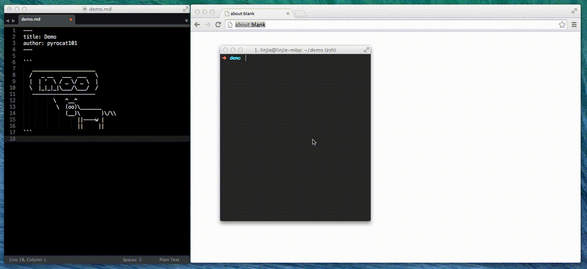

# Moo

```
   _____________________
  /   _ __   ___  ___   \
  |  | '  \ / _ \/ _ \  |
  \  |_|_|_|\___/\___/  /
   ---------------------
          \   ^__^
           \  (oo)\_______
              (__)\       )\/\\
                  ||----w |
                  ||     ||
```

moo is your **editor-agnostic** markdown live previewer. Write markdown in your favorite editor, save changes, and view pretty HTML output in your browser **instantly**.



## Features

* Github-flavored markdown
* Strip YAML front-matter automatically (Jekyll-friendly)
* Syntax highlight in code-blocks
* Github look-and-feel

## Usage

**Preview:** open live preview for `README.md` in browser.

``` bash
moo README.md
```

**Export:** generate self-contained HTML docs.

``` bash
moo --export ch1.md ch2.md ch3.md # generates ch{1,2,3}.html
```

See `moo --help` for detailed options and examples.

## Installation

``` bash
pip install moo
```

## Troubleshooting

If you get this error when running `moo`: `NameError: name 'PROTOCOL_SSLv3' is not defined`, upgrading `moo` and it's dependencies may fix it:

```
pip install --upgrade moo
```


## LICENSE

MIT
